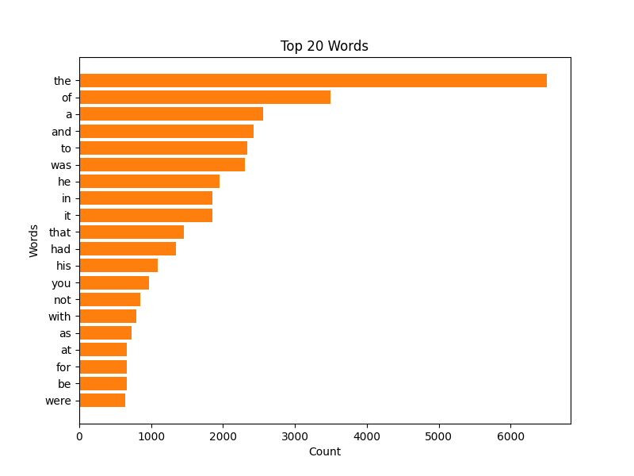

# goit-algo2-hw-06

## Visualize most common words on given text using MapReduce

With provided MapReduce implementation and text (world known book 1984) we can visualize most common words using matplotlib.



## How to run

```bash
python3 01.py
```

Of cource, you need to have `matplotlib` and `requests` installed.

Number of words to visualize can be changed by modifying `top` parameter in [01.py](./01.py#89) file, `visualize_top_words(result, top=20)`.
